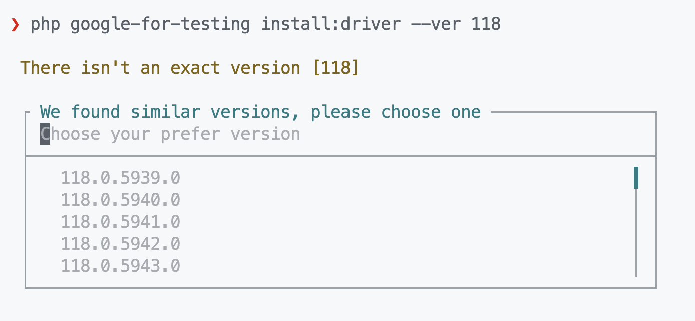

# Google for Testing - CLI

[](https://packagist.org/packages/asciito/google-for-testing)
[](https://packagist.org/packages/asciito/google-for-testing)
[](https://github.com/asciito/google-for-testing/actions/workflows/test.yml)
[](https://packagist.org/packages/asciito/google-for-testing)

This is a **personal project**, but the community can also contribute to this project, and is build with [Laravel Zero](https://github.com/laravel-zero/laravel-zero).

---

## ⚠️ THE `CLI` IS NOT READY YET, DON'T USE IN PRODUCTION ⚠️

## The why?

It's simple, because I need a tool to manage my Chrome Driver and Chrome Browser, but... the reason behind that
is that in my work, I need to automate some interaction in a webpage, and because that page doesn't have an API, and doing some manual tasks
is painfully boring... and, trying to spin-up a Chrome Driver server
with the correct Browser Version, is painful (I **HATE** manual tasks), I decided to create this tiny CLI (in commands, not in size) to help me.

**I HATE MANUAL TASKS**

---

## Documentation

* [Commands](#commands)
  * [Install Google Chrome Browser](#install-google-chrome-browser): `install:browser`
  * [Install Google Chrome Driver](#install-google-chrome-driver): `install:driver`
  * [Manage Google Chrome Driver](#manage-google-chrome-driver): `manage:driver`

### Commands

The two installation commands shares similar signatures, something like this:

```bash
./google-for-testing install:<browser|driver> [options]
```

There are three options available to change the way the command works.

- **`--ver=[VER]`**:
This option by default is set to `115.0.5763.0` in both commands.
If you provide a milestone version, this will trigger a search box to select all the versions available.
</br>
</br>
**Example**


    > **Note**:
    For the `install:driver` command, the default version it's really important, this is the started version from where you can get
    the `chromedriver` binary, before that version, we don't have access to it (for now).

- **`--latest`**:
This option will download the latest version.

- **`--path=[PATH]`**:
This will let you choose where to download it.

> **Note**:
> The default location for every download is `$HOME/.google-for-testing`

<br>

#### Install Google Chrome Browser

The syntax for to install Google Chrome Browser is the next one:

```bash
./google-for-testing install:browser [options]
```

Running this command without any option, will download the default version `115.0.5763.0`, but you can choose
any other version to download (if is available).

You can check the available versions on this [API endpoint](https://googlechromelabs.github.io/chrome-for-testing/known-good-versions.json) 👈

<br>

#### Install Google Chrome Driver

The syntax for to install Google Chrome Driver is the next one:

```bash
./google-for-testing install:driver [options]
```

Running this command without any option, will download the default version `115.0.5763.0`, but you can choose
any other version to download (if is available).

> **Note**: You can check the available versions on this [API endpoint](https://googlechromelabs.github.io/chrome-for-testing/known-good-versions.json) 👈, but keep in mind
> that for `chromedriver` the versions starts at `115.0.5763.0`, so any version below that we will not have access to the binary download link (for now).

<br>

#### Manage Google Chrome Driver

If you want to manage one instance or more of Google Chrome Browser, this could be a time-consuming task, and to simplify
this task, we have several action in one command.


The command `./google-for-testing manage:driver [--] [<action>]` have 6 actions to manage a Google Chorme Driver.

<details>
<summary><code>start</code> action</summary>

The first action is `start`, and this is as simple as running the next command:

```bash
./google-for-testing manage:driver start
```

This will start a new instance of Chrome Driver in port `9515` (by default).
</details>

<details>
<summary><code>stop</code> action</summary>

The second action is `stop`, and this is as simple as running the next command:

```bash
./google-for-testing manage:driver stop
```

This will stop the instance of Chrome Driver in port `9515` (by default).
</details>


<details>
<summary><code>restart</code> action</summary>

The third action is `restart`, and this is as simple as running the next command:

```bash
./google-for-testing manage:driver restart
```

This will restart the instance of Chrome Driver in port `9515` (by default).
</details>

<details>
<summary><code>status</code> action</summary>

The fourth action is `status`, and this is as simple as running the next command:

```bash
./google-for-testing manage:driver status
```

This will check the health of the Chrome Driver instance in port `9515` (by default).
</details>


<details>
<summary><code>list</code> action</summary>

The fifth action is `list`, and this is as simple as running the next command:

```bash
./google-for-testing manage:driver list
```

This will list all the Chrome Driver instances in a table. This table will have the
`PID` and `PORT`.

> **Note**:
> This command will list only the instances spin-up by this CLI.
</details>

<details>
<summary><code>kill</code> action</summary>

The sixth action is `kill`, and this is as simple as running the next command:

```bash
./google-for-testing manage:driver kill
```

This will search for all the instances of Chrome Driver in different ports, and then kill all the process.

> **Note**:
> This action will ask you for your permission to do it.
</details>

These are the six actions available in the command `manage:driver`, and we have two options we can use in conjunction
with these actions. For example, if you need to spin-up 2 or more instances of Chrome Driver, you
need to specify the ports where you need to spin up the servers with the option `--port` or `-p`.

```bash
./google-for-testing manage:driver start --port=9515 --port=9516
```

This will spin-up two servers, one in port `9515`, and the second one in port `9516`. As I said, this option can
be used with the other three other actions: `stop`, `restart`, and `status`.

> **Note**:
> This comand can only be use with the first four actions: `start`, `stop`, `restart`, and `status`.

The second one is just to specify where to search for the Chrome Driver binary, you just need to specify the option
`--path`.

```bash
./google-for-testing manage:driver start --path=/some/directory/path
```

This option will only search for the binary `chromedriver` in the path specify, so be sure to have this binary available
and named correctly.


## License

**Google for Testing - CLI** is an open-source software licensed under the [MIT license](./LICENSE.md).
